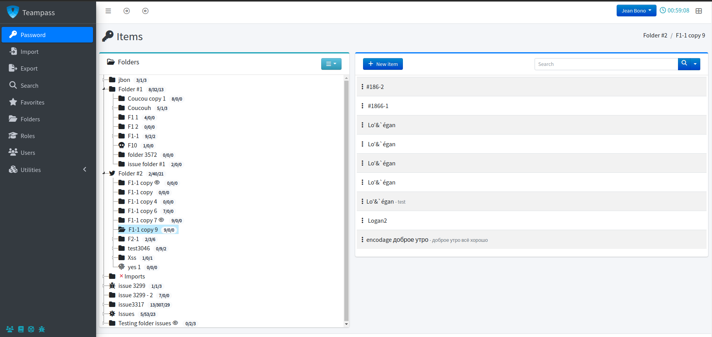

<!--
N.B.: Diese README wurde automatisch von <https://github.com/YunoHost/apps/tree/master/tools/readme_generator> generiert.
Sie darf NICHT von Hand bearbeitet werden.
-->

# Teampass für YunoHost

[](https://ci-apps.yunohost.org/ci/apps/teampass/)


[](https://install-app.yunohost.org/?app=teampass)

*[Dieses README in anderen Sprachen lesen.](./ALL_README.md)*

> *Mit diesem Paket können Sie Teampass schnell und einfach auf einem YunoHost-Server installieren.*  
> *Wenn Sie YunoHost nicht haben, lesen Sie bitte [die Anleitung](https://yunohost.org/install), um zu erfahren, wie Sie es installieren.*

## Übersicht

TeamPass is a Passwords Manager dedicated for managing passwords in a collaborative way by sharing them among team members.
Teampass offers a large set of features permitting to manage your passwords and related data in an organized way in respect to the access rights defined for each users.


**Ausgelieferte Version:** 3.1.4.11~ynh1

## Bildschirmfotos



## Dokumentation und Ressourcen

- Offizielle Website der App: <http://www.teampass.net>
- Offizielle Verwaltungsdokumentation: <https://teampass.readthedocs.io/en/latest/>
- Upstream App Repository: <https://github.com/nilsteampassnet/TeamPass>
- YunoHost-Shop: <https://apps.yunohost.org/app/teampass>
- Einen Fehler melden: <https://github.com/YunoHost-Apps/teampass_ynh/issues>

## Entwicklerinformationen

Bitte senden Sie Ihren Pull-Request an den [`testing` branch](https://github.com/YunoHost-Apps/teampass_ynh/tree/testing).

Um den `testing` Branch auszuprobieren, gehen Sie bitte wie folgt vor:

```bash
sudo yunohost app install https://github.com/YunoHost-Apps/teampass_ynh/tree/testing --debug
oder
sudo yunohost app upgrade teampass -u https://github.com/YunoHost-Apps/teampass_ynh/tree/testing --debug
```

**Weitere Informationen zur App-Paketierung:** <https://yunohost.org/packaging_apps>
