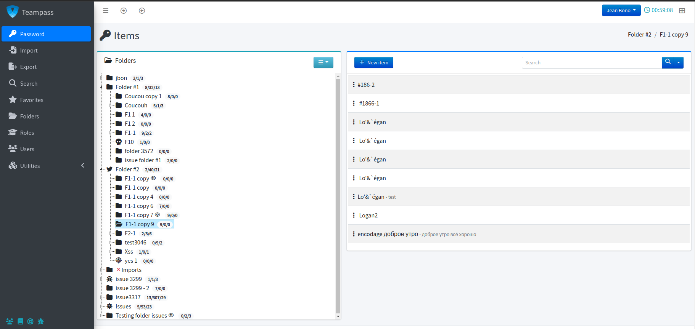

<!--
To README zostało automatycznie wygenerowane przez <https://github.com/YunoHost/apps/tree/master/tools/readme_generator>
Nie powinno być ono edytowane ręcznie.
-->

# Teampass dla YunoHost

[](https://ci-apps.yunohost.org/ci/apps/teampass/)


[](https://install-app.yunohost.org/?app=teampass)

*[Przeczytaj plik README w innym języku.](./ALL_README.md)*

> *Ta aplikacja pozwala na szybką i prostą instalację Teampass na serwerze YunoHost.*  
> *Jeżeli nie masz YunoHost zapoznaj się z [poradnikiem](https://yunohost.org/install) instalacji.*

## Przegląd

TeamPass is a Passwords Manager dedicated for managing passwords in a collaborative way by sharing them among team members.
Teampass offers a large set of features permitting to manage your passwords and related data in an organized way in respect to the access rights defined for each users.


**Dostarczona wersja:** 3.1.3.14~ynh1

## Zrzuty ekranu



## Dokumentacja i zasoby

- Oficjalna strona aplikacji: <http://www.teampass.net>
- Oficjalna dokumentacja dla administratora: <https://documentation.teampass.net>
- Repozytorium z kodem źródłowym: <https://github.com/nilsteampassnet/TeamPass>
- Sklep YunoHost: <https://apps.yunohost.org/app/teampass>
- Zgłaszanie błędów: <https://github.com/YunoHost-Apps/teampass_ynh/issues>

## Informacje od twórców

Wyślij swój pull request do [gałęzi `testing`](https://github.com/YunoHost-Apps/teampass_ynh/tree/testing).

Aby wypróbować gałąź `testing` postępuj zgodnie z instrukcjami:

```bash
sudo yunohost app install https://github.com/YunoHost-Apps/teampass_ynh/tree/testing --debug
lub
sudo yunohost app upgrade teampass -u https://github.com/YunoHost-Apps/teampass_ynh/tree/testing --debug
```

**Więcej informacji o tworzeniu paczek aplikacji:** <https://yunohost.org/packaging_apps>
